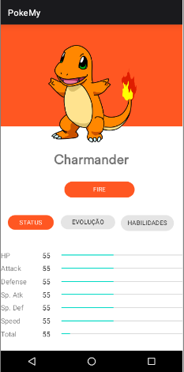
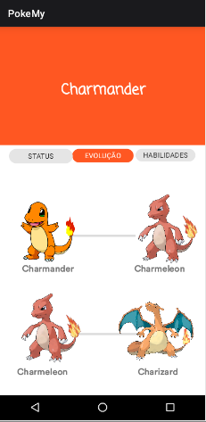

# Projeto Kotlin Android - AfroDev 
Projeto Kotlin Android é uma série de estudos sobre a construção de um Android organizado pelo AfroDev.
A principal proposta dessa série de artigos é apresentar os mais variados caminhos e 
componentes utilizados na construção de um aplicativo Android profissional.

### Módulo 1:
- Introdução ao Android
- Layouts e componentes de interface
- Lógica de programação

### Módulo 2:
- Princípios de Orientação a Objetos
- Componentes de interface
- Consumo de API;

### Módulo 3:
- Finalização do consumo de API
- Arquitetura Clean
- MVVM
- Injeção de dependências 
- Testes

### Projeto Final:
- Desenvolvimento prévio de uma PokeDex em Kotlin.

  
  
  
  

